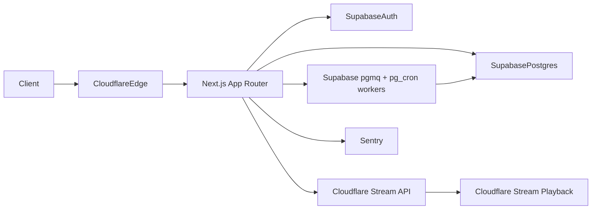

# Architecture

## Data flow
1. User auth/session handled by Supabase auth clients and `proxy.ts`.
2. Upload metadata request hits `/api/videos/upload` and returns signed ingest metadata.
3. Cloudflare Stream processing sends status callbacks to `/api/videos/stream/webhook`.
4. Video metadata, comments, subscriptions, and moderation records live in Supabase Postgres with RLS.
5. Feed retrieval uses ranking v1 (`freshness + velocity + quality`) and short cache revalidation.
6. Reports go through `/api/reports` and map to moderation queue workflows.

## Route groups
- `app/(site)` for user-facing shell and pages.
- `app/api/*` for domain APIs (feed, comments, reports, upload, webhooks).

## Observability hooks
- Sentry DSN env var wired for production-ready integration.
- Analytics provider env scaffold for event pipeline connection.
